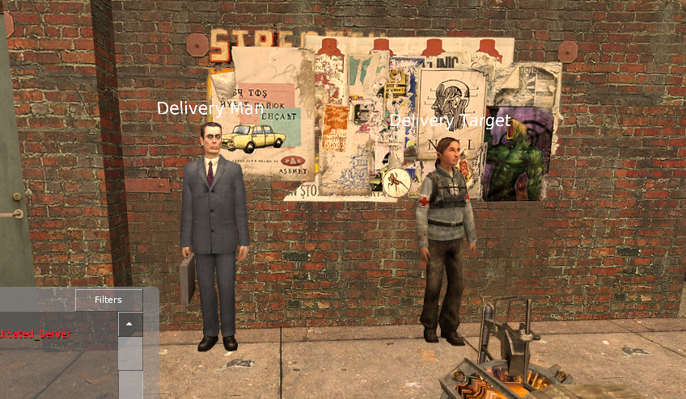

# Gmod Delivery System
A simple system that adds a job to your server.

## What is it
A simple system where players get packages, bring them to a citizen, and get money.

## Requirements
DarkRP - Use the latest version im too lazy to say a specific version

## Features
    1. Multiple package types
        - Different rewards
        - Different models
        - Different names
    2. Multiple target support
    3. Cooldowns

## The Process
    1. Use the delivery giver to get a quest
        - Supports multiple giver NPCs
    2. Pick up the package
    3. Bring it to the delivery target
        - Supports multiple targets, will select random one
    4. Get the reward

## Screenshots

**The two NPC types**

